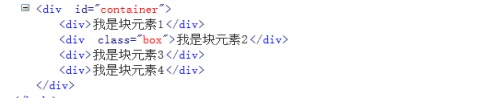
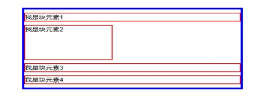

#块级元素和行内元素

#块级元素
div , p , form, ul, li , ol, dl, form, address, fieldset, hr, menu, table
#行内元素
span, strong, em, br, img , input, label, select, textarea, cite,


#块级元素的特点
1.它会自己占一行， 默认宽度等于父级元素宽度的100%
    
2.可以直接设置它的宽度和高度的样式
    
效果展示：
    

    

#行内元素的特点
1.不会独自占一行，和其他元素共用一行的空间
    
2.它的宽度和高度由里面的内容决定
    
3.不能直接设置内边距和外边距
#行内块元素的特点
1.具有块级元素的特点，内容区域可以自定义，margin,padding可以用了
    
2.2.具有行内元素的特点，可以跟任意非纯块级元素共用一行的空间

3.根据以上两个特点，其实我们就可以更好的去控制我们的排版布局


#行内块元素的垂直对齐
使用过程中要注意的地方:
	
1.如何水平对齐，给该行内块元素的父亲，设置text-align属性(但要注意，text-align具有可继承性，所以里面的子元素都会被设置了对应的text-align)
	
2.如何垂直对齐，给该行内块元素的父亲，设置行高，该行高等于父元素的高度，但要注意行高会被子元素所继承，所以需要在行内元素里，重新设置一次行高。
	
3.如何控制垂直对齐的方向,直接给行内元素设置vertical-align属性就可以了（前提是要设置行高）
	
4.如果多个行内块元素在一起，之间会出现空隙，是因为空格的原因，所以需要在他们的父元素加上font-size：0，但因为会有继承性，所以还需要给里面的子元素重新设置一个font-size。
#####实例

```
			.baba{
				height: 500px;
				background: lightyellow;
				text-align: center;
				line-height: 500px;
				font-size: 0;
			}
			.son{
				height: 100px;
				width: 100px;
				background: skyblue;
				display: inline-block;
				line-height: 100px;
				vertical-align: middle;
				/*margin-left: 100px;*/
				/*margin-top: 50px;*/
				font-size: 14px;
			}
		</style>
	</head>
	<body>
		<div class="baba">
			<div class="son">
				2333
			</div>
			<div class="son">
				666
			</div>
		</div>
	</body>
```

##整个案例
```
<html>
	<head>
		<meta charset="UTF-8">
		<title></title>
		<style type="text/css">
			/*
			 行内块级的区别
			 1.块级可以认为控制内容区域的大小，但行内元素并不支持（只能由内容本身大小决定）width  height
			 2.块级本身会强行占一行，不允许其他元素共处一行。
			   行内元素会更愿意跟非块级元素共处一行，除非不够位置。
			 3.块级元素支持外边距和内边距，但行内元素，只支持左右方向的外边距和内边距。margin  padding
			 
			 * */
			.baba div{
				background-color: skyblue;
				width: 100px;
				height: 100px;
				display: inline;
				line-height: 100px;
			}
			span{
				background-color: pink;
				width: 100px;
				height: 100px;
				margin: 50px;
				padding: 50px;
				line-height: 100px;
				display: block;
				/**
				 *行内块元素
				 * 1.具有块级元素的特点，内容区域可以自定义，margin,padding可以用了
				 * 2.具有行内元素的特点，可以跟任意非纯块级元素玩了
				 * 根据以上两个特点，其实我们就可以更好的去控制我们的排版布局
				 * 
				 * 使用过程中要注意的地方
				 * 1.如何水平对齐，给该行内块元素的父亲，设置text-align属性(但要注意，text-align具有可继承性，所以里面的子元素都会被设置了对应的text-align)
				 *
				 */
				display: inline-block;
			}
			.baba{
				background-color:yellow;
				text-align: center;
				text-align: right;
				height: 400px;
				line-height: 400px;
			}
		</style>
	</head>
	<body>
		<div class="baba">
		  <div>
			我是块级元素
		  </div>
		  <span>
			我是行内元素
		  </span>
		</div>
	</body>
</html>
```