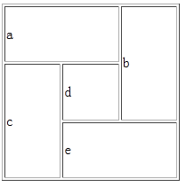

###img标签

| 类型|解释|
|-|-|
|png |颜色很丰富，但是IE6不支持PNG-24透明。|
|jpg|体积足够小，适用于网络传输使用|
|webp|特点体积小并支持透明，但暂时只有谷歌支持|
|gif|支持透明，256颜色，千万不要用在过多渐变色的场景|

```html
		<!--不透明图片，体积足够小，适用于网络传输使用-->
		
		<!--透明图片 png-->
		
		<!--新一代图片后缀webp，特点体积小并支持透明，但暂时只有谷歌支持-->
		
		<!--gif动图，支持透明，256颜色，千万不要用在过多渐变色的场景-->
		
```
###gif图片

###webp图片

###png图片

###jpg图片

###例子
```html
<!DOCTYPE html>
<html>
	<head>
		<meta charset="utf-8" />
		<title>img</title>
	</head>
	<body bgcolor="skyblue">
		<!--不透明图片，体积足够小，适用于网络传输使用-->
		
		<!--透明图片 png-->
		
		<!--新一代图片后缀webp，特点体积小并支持透明，但暂时只有谷歌支持-->
		
		<!--gif动图，支持透明，256颜色，千万不要用在过多渐变色的场景-->
		
	</body>
</html>
```
#心得
1.这是用来装图片的一个元素，是在网页上显示图片用的
2.应为如果网站只有文字的话，就会较为枯燥，加上图片的话会把网站美化的好一些。
3.当网站需要放图片的时候用
